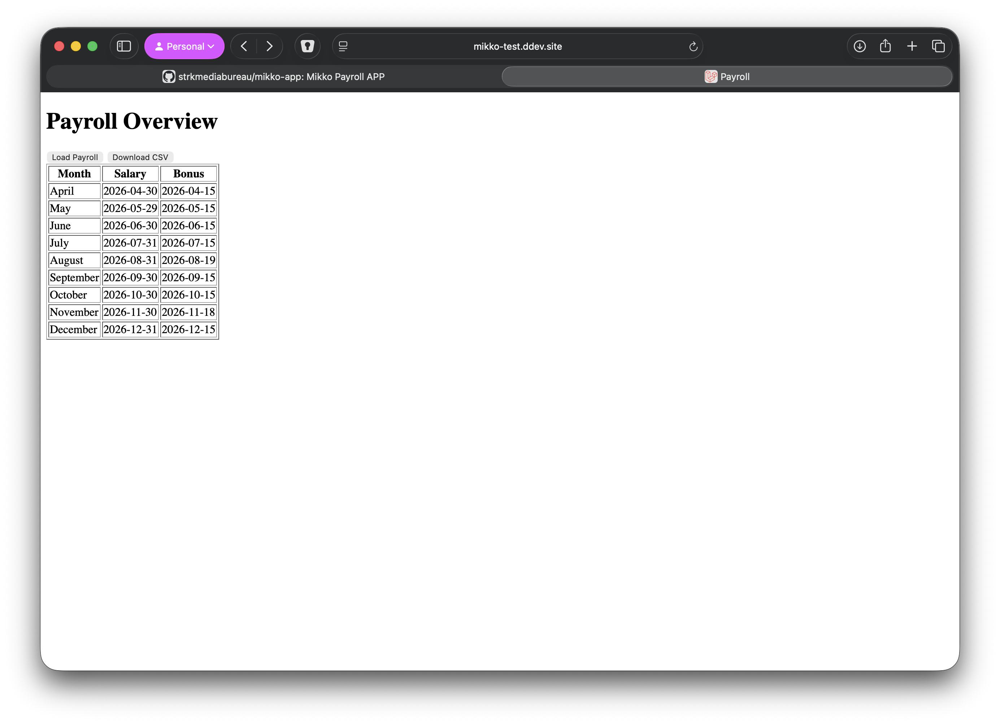
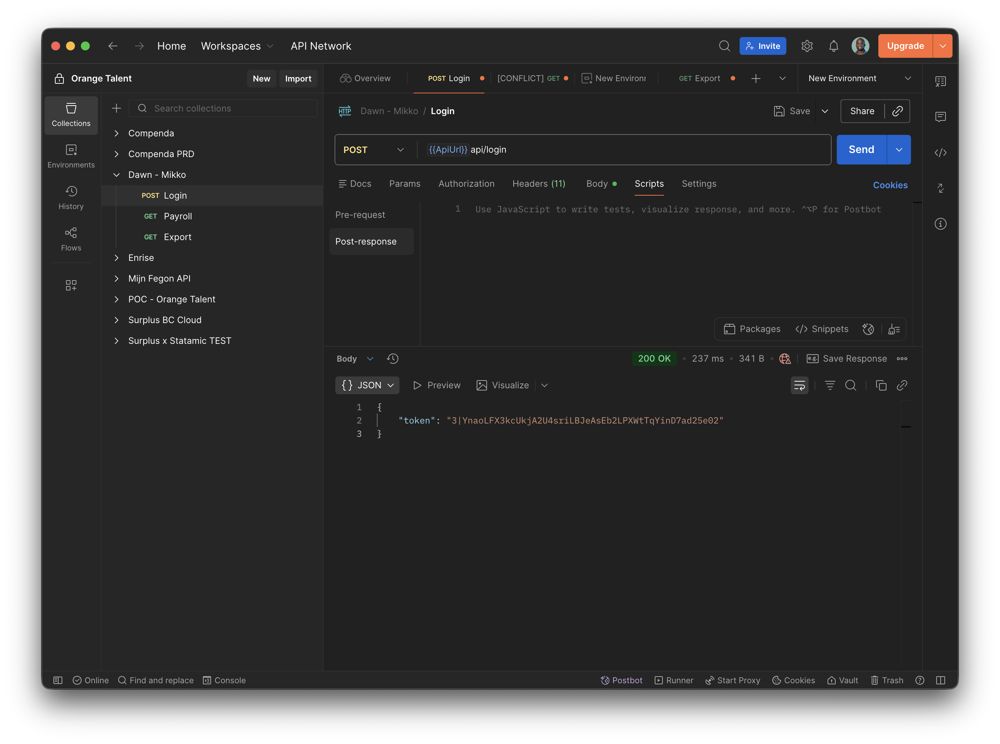
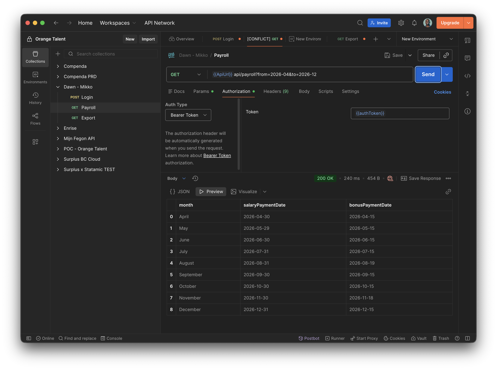
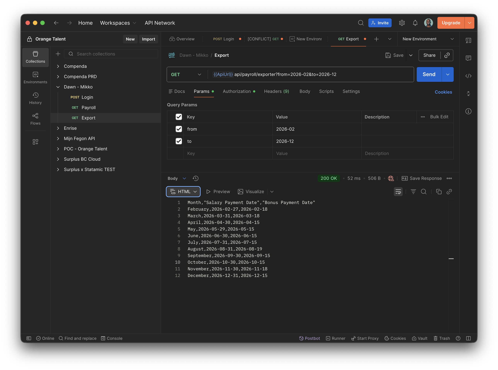

# Mikko Payroll APP

This application calculates payroll dates, built with Laravel.
The API provides all data for the frontend application and is developed locally using **DDEV** with **Docker**.

The application presents this data via an API and allows exporting it as a CSV file.

It determines:
* Monthly salary payment dates
* Monthly bonus payment dates

---

## Tech Stack

* **PHP / Laravel**
* **Laravel Sanctum** (API authentication)
* **Carbon** (date handling)
* **Vanilla JavaScript** (frontend)
* **DDEV** (local development environment)
* **Docker** (containerization)
* **MySQL** (database)

---

## Code Quality

This project uses pre-commit hooks with:

* **Laravel Pint** (code style)
* **PHPStan** (static analysis)

Pre-commit checks run automatically before each commit.

---

## API Endpoints    

| Endpoint                                        | Description                     |
|-------------------------------------------------|---------------------------------|
| `/api/login`                                    | Get API token                   |
| `/api/payroll`                                  | Get curent year payroll data    |
| `/api/payroll/{year}`                           | Get payroll data by year        |
| `/api/payroll?from=2026-02&to=2026-12`          | Get payroll data by filter      |
| `/api/payroll/exporter`                         | Export curent year payroll data |
| `/api/payroll/exporter{year}`                   | Export payroll data by year        |
| `/api/payroll/exporter?from=2026-02&to=2026-12` | Export payroll data by filter      |

---

## Environment Variables

Important `.env` values:

```
SANCTUM_API_TOKEN=
```





